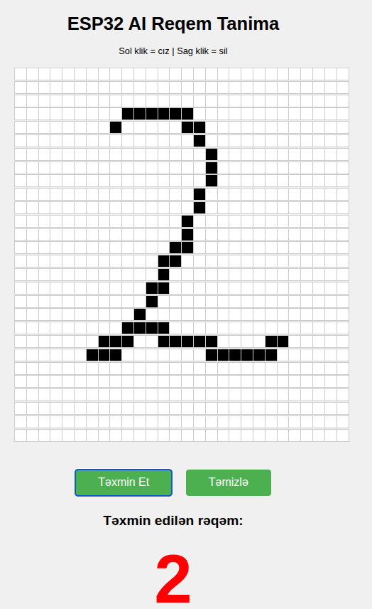
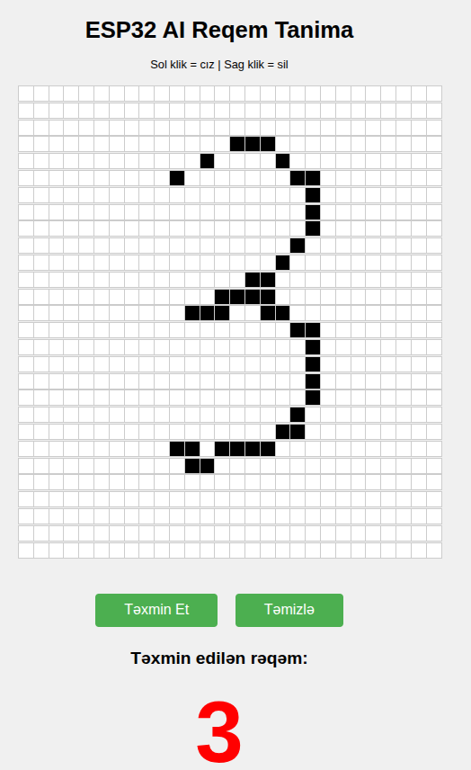
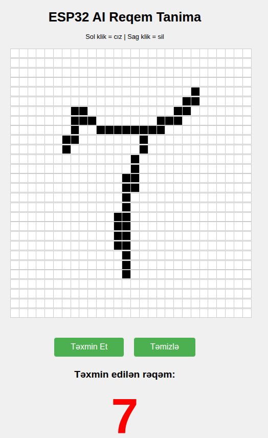

# ESP32 MNIST Rəqəm Tanıma — Azerbaycan

## Layihənin Məqsədi
Bu layihə ESP32 mikrokontroller üzərində TensorFlow Lite Micro istifadə edərək MNIST datasetindən öyrədilmiş model ilə rəqəm tanıma funksiyasını həyata keçirir. Web interfeys vasitəsilə istifadəçi 28x28 ölçülü griddə rəqəm çəkir və ESP32 cihazı bu rəqəmi tanıyır.

## Layihə Strukturu
- **mnist_modern.ino** — ESP32 əsas proqramı, WiFi və web server idarəsi, istifadəçi interfeysi və modelin çağırılması.
- **helper.h** — WiFi parametrləri, grid ölçüləri və HTML interfeysi.
- **neural.cpp / neural.h** — TensorFlow Lite Micro modelinin işlədilməsi, inference və sinif strukturu.
- **model.h** — Python-da öyrədilmiş modelin C array formatında saxlanması.
- **predict.cpp / predict.h** — Modelə input göndərib nəticəni qaytaran funksiya.
- **assets/** — Layihə ilə bağlı şəkillər (aşağıda istifadə olunacaq).
- **Train/mnist.ipynb** — Modelin öyrədilməsi üçün Python notebook.

## İşləmə Prinsipi
1. **WiFi və Web Server:** ESP32 WiFi-a qoşulur və web server açır. İstifadəçi web interfeysə daxil olur.
2. **Rəqəm Çəkilməsi:** HTML grid üzərində sol klik ilə hüceyrələr qaraldılır (rəqəm çəkilir), sağ klik ilə silinir.
3. **Təxmin Etmə:** "Təxmin Et" düyməsi ilə griddəki məlumat ESP32-yə JSON formatında göndərilir.
4. **Model Inference:** ESP32-də TensorFlow Lite Micro model inputu qəbul edir və rəqəmi tanıyır.
5. **Nəticə:** Tanınan rəqəm web interfeysə qaytarılır və ekranda göstərilir.

## Kodun Detalları
### mnist_modern.ino
- WiFi və web server qurulur.
- `/send` endpoint-i JSON matrix qəbul edir və `predict()` funksiyası ilə tanıma aparır.
- Nəticə web interfeysə qaytarılır.

### helper.h
- WiFi SSID və parol.
- Grid ölçüləri (28x28).
- HTML interfeys: grid, düymələr, nəticə bölməsi.

### neural.cpp / neural.h
- TensorFlow Lite Micro modelini RAM-da saxlayır.
- Operatorlar: Reshape, FullyConnected, Softmax.
- `NeuralNet` sinifi: modelin versiyasını yoxlayır, operatorları əlavə edir, tensorları ayırır.
- `getData(float data[])`: inputu modelə verir, ən yüksək ehtimalı tapır və nəticəni qaytarır.

### model.h
- Python-da öyrədilmiş modelin C array formatında saxlanması.

### predict.cpp / predict.h
- `predict(float data[])`: NeuralNet obyektini yaradıb, inputu modelə verir və nəticəni qaytarır.

## Web Interfeys
İstifadəçi griddə rəqəm çəkir və ESP32-yə göndərir. HTML və JS kodu `helper.h` faylında saxlanır.

## Şəkillər
Layihənin işini vizual göstərmək üçün aşağıdakı şəkillərdən istifadə edin:

## Quraşdırma və İstifadə
1. ESP32-yə kodu yükləyin.
2. WiFi parametrlərini `helper.h` faylında dəyişin.
3. Web interfeysə daxil olun (ESP32 IP adresi).
4. Rəqəm çəkib "Təxmin Et" düyməsini basın.

## Modelin Öyrədilməsi
`Train/mnist.ipynb` faylında Python ilə MNIST datasetində model öyrədilir və C array formatına çevrilir.

## Əlavə Qeydlər
- Layihə mikrokontrollerlərdə AI tətbiqləri üçün əla nümunədir.
- Kodda commentlər vasitəsilə hər bir addım izah olunub.
- TensorFlow Lite Micro istifadə edildiyi üçün modelin ölçüsü və RAM istifadəsi optimallaşdırılıb.

---

**Layihə haqqında suallarınız varsa, müraciət edə bilərsiniz!**
# esp32s3_mnist_predict_web
